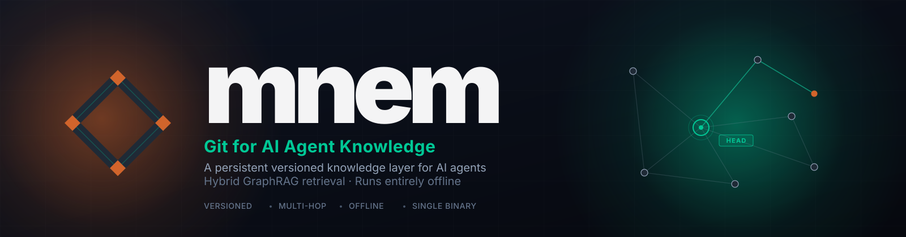

<div align="center">



[](LICENSE)
[](https://github.com/Uranid/mnem/actions/workflows/ci.yml)
[](https://crates.io/crates/mnem-cli)
[](https://pypi.org/project/mnem-cli/)
[](https://www.npmjs.com/package/mnem-cli)
[](rust-toolchain.toml)
[](#install)

</div>

<div align="center">

[English](README.md) &nbsp;·&nbsp; [中文](README.zh-CN.md) &nbsp;·&nbsp; [Español](README.es.md)

</div>

<hr>

<div align="center">

https://github.com/user-attachments/assets/bd744a7e-8e89-4531-bd96-fdee0030c390

</div>

<hr>

1. [The Problem](#the-problem)
2. [What is mnem](#what-is-mnem)
3. [Benchmarks](#benchmarks)
4. [What you get](#what-you-get)
5. [Install](#install)
6. [Quickstart](#quickstart)
7. [Integrate / Unintegrate](#mnem-integrate---wire-into-any-agent-host)
8. [Commands](#commands)
9. [MCP Tools](#mcp-tools)
10. [Python API](#python-api-mnem-py)
11. [GraphRAG](#graphrag)
12. [vs others](#compared-to-others)
13. [When NOT to use](#when-not-to-use-mnem)
14. [Docs](#documentation)
15. [Contributing](#contributing)

<hr>

## The Problem

> **Who this affects:** If you use AI coding assistants (Claude Code, Cursor, Gemini CLI, etc.) or build software where an AI agent needs to remember things between sessions, this is the problem mnem solves.

> **Every session starts from zero.**

- **Sessions are isolated.** Plan a migration in Claude Code (an AI coding assistant). Open Cursor (another AI coding assistant) tomorrow. That agent has never heard of it.
- **Memory you can't inspect isn't memory.** Something changed in your agent's context. You don't know what, when, or why. There's no log.
- **Conventions rot in flat files.** Six engineers, six `AGENTS.md` files (agent configuration files many AI tools read automatically) diverging in silence. No merge, no history, no way to tell which is current.

> Your codebase has git. Your agent's knowledge doesn't.

<hr>

## What is mnem

> **Not familiar with git or version control?** Git is software that saves numbered snapshots of your files over time - so you can track changes, undo mistakes, and collaborate. mnem does the same thing for your AI agent's knowledge: every write is a saved snapshot you can branch, diff, merge, or revert.

**Git for AI Agent Knowledge.** A persistent, versioned knowledge layer for AI agents - with best or tied recall on every benchmark we tested (recall = fraction of correct results returned; higher is better).

A **knowledge graph** is a searchable store of facts where entries can link to each other - think of it as a smart notebook your AI agent can write to and read from. For example: write "the deploy window is Tuesdays 10-11 AM UTC", link it to your release checklist, and later retrieve it by asking "what's our deploy schedule?" in plain English. (For those who want the technical term: facts are stored as nodes connected by typed relationship edges - `part_of`, `relates_to`, `depends_on`, etc.)

mnem gives your AI agent's knowledge the same primitives developers use for code:

- **commit** - save a versioned snapshot of everything the agent knows
- **branch** - create an independent copy to experiment on
- **diff** - see exactly what changed between any two snapshots
- **revert** - undo a bad batch of commits
- **blame** - see which agent wrote each piece of knowledge

Skills, decisions, and context live in a queryable graph stored in your project folder. Commit the `.mnem/` directory and it moves with your code. Replace stale `.cursorrules` (Cursor's project-rules file) and `AGENTS.md` files with something your whole team can version, diff, and merge.

Retrieval combines vector search (finds results by meaning, not just exact words - e.g. "deploy schedule" finds "deploy window"), keyword search (exact terms), and graph traversal (following links between entries) in one pass. Every query reports exactly how many tokens were consumed and what was filtered out - nothing is silently dropped. One binary (a single executable file), no server to run. Wire into Claude Code, Cursor, Gemini CLI, or any MCP (Model Context Protocol - a standard for giving AI tools access to external capabilities) host in one command; use it from the CLI, HTTP, or Python.

> **For teams:** Commit `.mnem/` alongside your code and every teammate's agents start from the same knowledge baseline. See [mnem push / mnem pull](#10-mnem-push--mnem-pull--mnem-clone---sync-with-a-remote) for CI sync.

## Benchmarks

**Measured head-to-head against mem0 and MemPalace on six public datasets. mnem leads on five‡†; ties MemPalace on LongMemEval.**

> **Benchmark caveats (read before interpreting the chart):** Two datasets have methodology differences that prevent direct comparison: **LoCoMo ‡** - mnem uses MAX-over-turn-hits scoring (lenient); MemPalace uses per-turn aggregation (stricter) - a higher mnem number here does not mean "better recall". **FinanceBench †** - mnem used hybrid retrieval (`--hybrid-boost --query-expand`); MemPalace used pure vector - different pipelines. See footnotes inside the details block below for full analysis.

> **In plain English:** mnem found the right answer more often than its competitors in 5 out of 6 tests. You don't need to understand the methodology to use mnem - skip to [Install](#install) if you just want to try it.

<div align="center"></div>

<details>
<summary><b>Methodology, footnotes, query speed, and reproduction steps</b></summary>

> **Methodology:** mem0 numbers are our own reproduction under the same harness - mem0 does not publish R@K (Recall at top K - the fraction of correct answers returned in the top K results) headline scores on these datasets. MemPalace headline numbers are cross-verified under our harness. This is disclosed, not hidden: reproducible artifacts ship alongside the binary.

Default harness embedder: MiniLM-L6-v2 (a small pre-trained text model in ONNX format - ONNX is an open file format for AI models; you don't need to install anything separately), same bytes across all systems in each test. FinanceBench uses bge-large on all systems for fair comparison (see † footnote). No LLM rerank. Sample counts per run: LongMemEval 500 Q, LoCoMo full dataset (~1986 Q), ConvoMem 50/category, MemBench 100/config. All benchmarks use dense-only retrieval (no sparse/BM25 lane). Reproduce: `bash benchmarks/harness/run_bench.sh`.

<sup>mem0 columns: our reproduction under the same harness (mem0 doesn't publish R@K headlines on these datasets). MemPalace columns: public headline numbers cross-verified under our harness. Raw artefacts: [`benchmarks/results/v0.1.0/`](benchmarks/results/v0.1.0/). † FinanceBench uses Ollama bge-large (1024-dim) on all systems; MemPalace shown at best configuration (bge-large direct ChromaDB); mem0 applies LLM memory extraction before storage. Pipeline note: mnem FinanceBench run used hybrid retrieval (`--hybrid-boost --query-expand`); MemPalace bge-large used pure vector retrieval - pipelines differ. Full methodology: [`benchmarks/results/analysis/financebench.md`](benchmarks/results/analysis/financebench.md). ‡ LoCoMo: mnem uses MAX-over-turn-hits session scoring (lenient); MemPalace uses per-turn aggregation (stricter) - scores reflect different evaluation methodology. See [`benchmarks/results/analysis/locomo.md`](benchmarks/results/analysis/locomo.md).</sup>

### Query speed

<div align="center"></div>

<details>
<summary><b>Reproduce</b></summary>

```bash
mnem bench fetch longmemeval     # download datasets (one-time, 264 MB)
mnem bench                       # TUI; select benchmarks interactively
mnem bench run --benches longmemeval --limit 50 --non-interactive
mnem bench results ./bench-out   # re-render results from a prior run

# Legacy bash harness (canonical path for headline numbers)
bash benchmarks/harness/run_bench.sh
```

Methodology, raw artifacts, per-bench breakdowns: [`benchmarks/`](benchmarks/) and [`docs/src/benchmarks/`](docs/src/benchmarks/).

</details>

</details>

<hr>

## What you get

<sup> unique to mnem &nbsp;·&nbsp;  rare among peers</sup>

| | | |
|:---:|:---|:---|
|  | **Instantly build a knowledge graph from any file or codebase. No LLM call required.** Drop in source code, PDFs, Markdown docs, or conversation exports - mnem handles the rest. One command. 30+ file formats, parsed and indexed automatically. | [READ MORE](docs/features/rich-ingest.md) |
|  | **Branch, diff, and merge knowledge like git.** Every write is a versioned commit. Experiment on a branch, merge when ready - your knowledge graph has the same primitives as your codebase. | [READ MORE](docs/features/versioned-memory.md) |
|  | **Replace flat agent files with a versioned, queryable graph.** `.cursorrules` and `AGENTS.md` can't be diffed or merged. mnem can - export yours, import a teammate's, merge the parts you want. | [READ MORE](docs/features/skills-graph.md) |
|  | **See exactly what retrieval found, skipped, and cost.** Every query returns `tokens_used`, `candidates_seen`, and `dropped`. No silent truncation at your token budget. | [READ MORE](docs/features/token-transparency.md) |
|  | **Same input, same output, any machine (storage layer).** Every piece of content gets a unique fingerprint based on its exact bytes. Store the same fact twice and mnem deduplicates it automatically - no matter which machine, which session, or which user ingested it. Retrieval results are ranked by approximate similarity and may vary slightly across runs. | [READ MORE](docs/features/content-addressing.md) |
|  | **Runs in a browser tab.** *(Advanced - skip if you're just using the CLI.)* The same binary runs in Chrome via WASM (WebAssembly - a way to run compiled code in a browser) and deploys in AWS Lambda (~40 MB). No Python, no external database. WASM bindings ship separately; see [`docs/features/wasm-edge.md`](docs/features/wasm-edge.md). | [READ MORE](docs/features/wasm-edge.md) |
|  | **Best or tied recall on every benchmark we tested.** Leads on five of six public benchmarks (recall = fraction of correct results returned; higher is better). All numbers reproducible with the shipped harness. See [Benchmarks](#benchmarks) above for details. | [READ MORE](docs/features/benchmarks.md) |
|  | **Zero-config start, any provider after.** A small pre-trained text model runs automatically in-process (~40 MB binary total, no setup). Switch to Ollama, OpenAI, or Cohere with one line in `config.toml` (a simple key-value config file). | [READ MORE](docs/features/providers.md) |
|  | **CLI (command-line tool), HTTP (web API), MCP, and Python - one engine.** `mnem integrate` wires the MCP server into Claude Code, Cursor, Gemini CLI, and anything else speaking MCP. | [READ MORE](docs/features/integrations.md) |
|  | **One ~40 MB binary. Nothing else required.** No background service (daemon), no cloud, no account. Runs fully offline. Same binary powers the CLI and the HTTP server. | [READ MORE](docs/features/single-binary.md) |
|  | **API-free, deterministic ingestion.** No LLM call at index time. Same file always produces identical nodes - fully reproducible and audit-friendly. Re-ingest an unchanged file and get zero new nodes. | [READ MORE](docs/features/deterministic-ingest.md) |
| | **Vector, keyword, and graph search in one pass.** Enable multi-hop traversal (following a chain of links across multiple connected entries) for queries that span documents; skip it for fast single-doc lookup. | [READ MORE](docs/features/hybrid-retrieval.md) |

<hr>

## Install

**New to the command line?** On Windows press `Win+R`, type `cmd`, press Enter. On macOS open Spotlight (`Cmd+Space`) and type `Terminal`. On Linux search "Terminal" in your apps.

**Prerequisites:** Check what you have: `python --version` / `node --version` / `cargo --version`. Don't have any? [Install Python](https://www.python.org/downloads) or [Install Node.js](https://nodejs.org/en/download) - both are free and include pip/npm. For Cargo: [Install Rust via rustup](https://rustup.rs/) (free, also installs `cargo`).

**Pick whichever one you already have. Any one works.**

> **Not sure which to pick?** Use `pip install mnem-cli` (Python) or `npm install -g mnem-cli` (Node.js) - both ship the pre-built binary with zero extra setup. Cargo compiles from source and takes 5-15 minutes on first run. Full per-platform notes below.

> **Using Python to call mnem from your own app?** `pip install mnem-cli` gives you the `mnem` command-line tool. To import mnem from Python code (`import pymnem`), use `pip install mnem-py` instead - see [Python API](#python-api-mnem-py).

```bash
# if you have pip (Python)  - simplest for most people; bundled embedder included, no extra setup
pip install mnem-cli         # gives you the `mnem` command-line tool

# Want to use mnem FROM Python code? That's a separate package:
pip install mnem-py           # Python library — import with `import pymnem` (not `import mnem`)

# if you have npm (Node.js) - bundled embedder included, no extra setup
npm install -g mnem-cli

# if you have Cargo (Rust): compiles from source, ~5-15 min first run
# Linux only: first run `sudo apt-get install g++` (Debian/Ubuntu/WSL) or `sudo dnf install gcc-c++` (Fedora/RHEL)
cargo install --locked mnem-cli --features bundled-embedder
```

```bash
mnem --version    # confirm install
```

> **If `mnem: command not found`:** Try opening a new terminal first (PATH changes only take effect in new sessions). On Linux, pip installs to `~/.local/bin` - if that's not in your PATH, run `export PATH="$HOME/.local/bin:$PATH"` then add that same line to `~/.bashrc` (this is a one-time fix; the file change makes it permanent). On Windows: 1. Run `pip show mnem-cli`. 2. Copy the `Location` value (e.g. `C:\Users\you\AppData\Roaming\Python\Python312\site-packages`). 3. Replace `site-packages` with `Scripts` to get the Scripts folder path. 4. Open System Properties → Environment Variables → Path → Edit → New → paste the Scripts path → OK. 5. Open a new Command Prompt - PATH changes require a new window to take effect.

> [!NOTE]
> `--locked` pins the exact tested dependency versions. An **embedder** is a small AI model that converts text into numbers so mnem can find results by meaning (not just exact words) - you need one for `mnem retrieve` to work. Cargo features are optional compile-time flags that include extra code in the binary. `--features bundled-embedder` packs a pre-trained text model (MiniLM-L6-v2, ~40 MB) directly into the binary so `mnem retrieve` works with zero configuration - no internet, no extra download, no setup. **This flag is Cargo-only.** The pip and npm packages ship with the embedder pre-baked - `mnem retrieve` works immediately with no extra steps. **If you omit `--features bundled-embedder` on a Cargo install** without configuring another embedder (Ollama, OpenAI, Cohere) in `.mnem/config.toml`, `mnem retrieve` fails at runtime with an "embedder not configured" error.

<details>
<summary>Sample <code>.mnem/config.toml</code> (Ollama example)</summary>

```toml
[embed]
provider = "ollama"
model    = "nomic-embed-text"
base_url = "http://localhost:11434"
```

Full list of config keys: [`docs/src/configuration.md`](docs/src/configuration.md).

</details>

<details>
<summary><b>macOS / Linux</b></summary>

No Cargo? [Install via rustup](https://rustup.rs/) (also installs `rustc`).

```bash
# C++ stdlib required to link the bundled ONNX Runtime (Linux only)
sudo apt-get install g++          # Debian / Ubuntu / WSL
# sudo dnf install gcc-c++        # Fedora / RHEL
```

```bash
cargo install --locked mnem-cli --features bundled-embedder

# CUDA-accelerated embedder (Linux, NVIDIA GPU)
cargo install --locked mnem-cli --features bundled-embedder-cuda
```

If `mnem` is not found after install, `~/.cargo/bin` is not on `$PATH`.

**rustup install**: source the env (or open a new terminal):
```bash
source ~/.cargo/env
```

**System Rust (apt/dnf)**: add to PATH permanently:
```bash
echo 'export PATH="$HOME/.cargo/bin:$PATH"' >> ~/.bashrc && source ~/.bashrc
```

</details>

<details>
<summary><b>Windows</b></summary>

No Cargo? [Install via rustup](https://rustup.rs/) (also installs `rustc`).

```powershell
cargo install --locked mnem-cli --features bundled-embedder

# DirectML-accelerated embedder (any GPU vendor on Windows)
cargo install --locked mnem-cli --features bundled-embedder-directml
```

</details>

<details>
<summary><b>npm / Node.js</b></summary>

No npm? [Install Node.js](https://nodejs.org/en/download) (npm is bundled, Node 18+ required).

```bash
npm install -g mnem-cli
mnem --version

# or without a global install (one-shot)
npx mnem-cli --version
```

Downloads the prebuilt native binary for your platform at install time. Node 18+ required. Bundled embedder included - no Ollama or API key needed.

</details>

<details>
<summary><b>pip (PyPI)</b></summary>

No pip? [Install Python](https://www.python.org/downloads/) (pip is bundled with Python 3.4+).

```bash
pip install mnem-cli
mnem --version
```

Ships the `mnem` binary as a manylinux / macOS / Windows wheel with the bundled embedder pre-baked.

</details>

<details>
<summary><b>Docker</b></summary>

No Docker? [Install Docker Desktop](https://docs.docker.com/get-started/get-docker/).

```bash
# Ephemeral (data is lost when the container stops — for quick testing only):
docker run --rm -p 9876:9876 \
  -e MNEM_HTTP_ALLOW_NON_LOOPBACK=1 \
  ghcr.io/uranid/mnem:latest http --bind 0.0.0.0:9876

# Persistent (data survives restarts — recommended for any real use):
mkdir -p ./mnem-data
docker run -p 9876:9876 \
  -v "$(pwd)/mnem-data:/data" -w /data \
  -e MNEM_HTTP_ALLOW_NON_LOOPBACK=1 \
  ghcr.io/uranid/mnem:latest http --bind 0.0.0.0:9876
# Windows (PowerShell): replace $(pwd) with ${PWD}; Windows (cmd.exe): replace $(pwd) with %cd%
```

The image includes the bundled embedder. The `--bind 0.0.0.0:9876` flag and
`MNEM_HTTP_ALLOW_NON_LOOPBACK=1` env var are required inside Docker so the
port mapping (`-p 9876:9876`) works; the default loopback bind is unreachable
from the host. Run `mnem mcp` inside the container for the MCP server surface.

> **Fresh volume (no prior data):** If the mounted `/data` directory has no `.mnem/` present, `mnem http` auto-initializes a new graph on first start - no manual `mnem init` required. Subsequent restarts reuse the existing graph.

> **Image tag pinning:** `ghcr.io/uranid/mnem:latest` always points to the most recent release. For production deployments, pin to a specific version tag (e.g., `ghcr.io/uranid/mnem:v0.1.0`) to avoid unexpected upgrades.

</details>

<details>
<summary><b>From source</b></summary>

```bash
# C++ stdlib required to link the bundled ONNX Runtime (Linux only)
sudo apt-get install g++          # Debian / Ubuntu / WSL
# sudo dnf install gcc-c++        # Fedora / RHEL
```

```bash
git clone https://github.com/Uranid/mnem
cd mnem
cargo install --path crates/mnem-cli --features bundled-embedder
```

Requires Rust 1.95+. If needed: `rustup install 1.95 && rustup default 1.95`.

</details>

```bash
mnem --version
mnem doctor        # checks embedder + store + config, prints a green/yellow/red checklist
```

Full install matrix: [`docs/src/install.md`](docs/src/install.md).

> **Embedding mnem inside a Python app?** The `pip install mnem-cli` above ships the **CLI binary** as a wheel. The native **Python API** (`import pymnem`) lives in a separate package. Jump to **[Python API (mnem-py) ↓](#python-api-mnem-py)** for `pip install mnem-py` and snippets.

<hr>

## Quickstart

**Step 1: Try it now (standalone, no AI assistant needed)**

```bash
mkdir my-graph
cd my-graph
mnem init          # required once per project — creates the .mnem/ folder that stores your graph
mnem ingest --text "mnem is a versioned knowledge graph for AI agents"
mnem retrieve "what does mnem do"
```

> **`mnem init` is required before `mnem ingest` or `mnem retrieve`.** Running `mnem ingest` without it gives an error like "no .mnem store found". You only run `mnem init` once per project directory.

> **What the output looks like:**
> ```
> [1] score=0.94  mnem is a versioned knowledge graph for AI agents
>     tokens_used=12  candidates_seen=1  dropped=0
> ```
> `tokens_used` = words consumed from your context; `candidates_seen` = entries scored; `dropped` = filtered out.

> **Windows cmd.exe users:** The commands above work as-is. If you copy them from a bash tutorial that includes lines starting with `#`, omit those lines - `#` starts a comment in bash/PowerShell but is a literal character in cmd.exe. PowerShell users: the commands work as shown.

> **If you see 0 results or an "embedder not configured" error:** run `mnem doctor` - it checks your embedder and store setup and prints a green/yellow/red checklist.

> **Why not grep?** `mnem retrieve` is semantic search - the query "what does mnem do" finds "versioned knowledge graph for AI agents" even though none of those words appear in the query. `tokens_used` / `candidates_seen` / `dropped` show exactly how much context was consumed and what was filtered out.

> **Tip:** `.mnem/` stores memory for this project only. mnem also has a global graph at `~/.mnemglobal/.mnem/` for facts that span all your projects - write to it with `mnem global add` and read from it with `mnem global retrieve`. See the "Local vs global graph" note in Step 2 below for the full comparison.

**Step 2 (optional): Wire your AI assistant**

> **Prerequisite:** This example uses Claude Code as the AI assistant. If you haven't installed Claude Code, download it free at [claude.ai/code](https://claude.ai/code), then return here. Prefer to skip the agent integration? Jump to the "Session 2" line in the code block below - `mnem retrieve` works standalone without any agent host.

> **Working directory:** The commands below create `.mnem/` inside `my-graph/`. Always open Claude Code from the `my-graph/` directory (or a subdirectory of it) after wiring — if you launch Claude Code from a different folder, it won't find that project's graph and will show `0 item(s)`.

```bash
# Session 1: add a fact and wire the agent
mnem init     # skip if you already ran this in Step 1
mnem ingest --text "The API retry policy uses exponential backoff with a 3-attempt limit"
mnem integrate claude-code    # wires MCP server + auto-retrieval trigger + system prompt
# Using Cursor instead? Replace with: mnem integrate cursor
# Want to wire everything at once? Use: mnem integrate --all
# Close and reopen the application to activate — close the window entirely, not just the terminal.
# To verify: open any Claude Code session and send any message.
# You should see a line like "mnem: 3 item(s): [...]" as a system message at the
# top of the conversation before Claude speaks.
# "mnem: 0 item(s)" also means the integration is working - graph is just empty.
# Still seeing 0 items after ingesting? Make sure your terminal is inside the
# my-graph/ directory (or whichever directory has .mnem/) when you open Claude Code.

# Session 2 (next day, new terminal): memory persists
cd my-graph
mnem retrieve "what is our API retry policy"
# Returns the fact from above. Add more: mnem ingest --text "..." or mnem ingest your-file.md
```

> **Local vs global graph:** `.mnem/` in your project directory holds project-specific memory. `~/.mnemglobal/.mnem/` (the global graph, where `~` means your home directory - e.g. `C:\Users\you` on Windows, `/home/you` on Linux/macOS) holds facts that span all your projects - personal preferences, shared team conventions, cross-repo entities. Use `mnem global retrieve` and `mnem global add` to target it.

**Next steps:**
- Ingest a file: `mnem ingest README.md` (or `mnem ingest your-docs/ --recursive` for a whole directory)
- Wire your AI assistant: `mnem integrate` (Claude Code, Cursor, and more)
- Ask anything: `mnem retrieve "your question"`

Five minutes from zero. See [`docs/src/quickstart.md`](docs/src/quickstart.md) for the full walkthrough.

<hr>

## `mnem integrate` - wire into any agent host

> **Not using Claude Code, Cursor, or another AI coding assistant?** Skip this section - `mnem integrate` is only needed if you want one of those tools to pick up mnem automatically.

> **Claude Code, Cursor, and similar tools must already be installed.** `mnem integrate` detects which are present - run `mnem integrate --check` first to see what's detected.

One command wires three things into your agent host: the **MCP server** (gives the agent access to mnem tools like `mnem_retrieve` and `mnem_commit`), the **auto-retrieval trigger** (runs `mnem retrieve` automatically before each of your messages so relevant memory is ready before the agent replies; Claude Code only - implemented as a "UserPromptSubmit hook"), and the **mnem system prompt** (tells the agent how to use mnem). Restart the host (close and reopen Claude Code or Cursor as an application, not just the terminal) and the agent starts using mnem automatically. To verify: start a new session and send any message - you should see a line like `mnem: 3 item(s): [...]` appear as a system message at the top of the conversation, injected before Claude speaks. `0 item(s)` is fine - it means the graph is empty; the integration is working.

> **Troubleshooting:** Not seeing `mnem: N item(s)`?
> - Make sure you closed and reopened the **application** (not just the terminal) - this means close the Claude Code or Cursor window entirely and relaunch it
> - Open the application from inside the directory that contains your `.mnem/` folder (or any subdirectory of it) - if you open Claude Code from a different folder, it won't find that project's graph
> - Run `mnem doctor` to check the embedder and store are healthy
> - Run `mnem integrate --check` to see if the host was wired correctly

```bash
mnem integrate                           # interactive: detect installed hosts and prompt
mnem integrate claude-code               # wire a specific host, skip interactive detection
mnem integrate --all                     # wire every detected host without prompting

mnem integrate --check                   # report wired state for all hosts; nothing changes
mnem integrate --dry-run                 # preview what would be written without changing anything
mnem integrate --show claude-code        # print the MCP JSON block for manual copy-paste

mnem integrate --no-hooks                # skip UserPromptSubmit hook wiring
mnem integrate --no-system-prompt        # skip system prompt wiring
mnem integrate --target-repo ~/notes     # point the MCP server at a specific graph, not the global one
```

**What gets wired:**
- **MCP server** (`mcpServers.mnem`) - the agent gets full mnem tool access via `mnem mcp --repo <graph>`; defaults to the global graph (`~/.mnemglobal/.mnem`)
- **Auto-retrieval trigger** (Claude Code only; implemented as a "UserPromptSubmit hook") - runs `mnem retrieve` before each of your messages so relevant memory is injected into context before the model ever sees your prompt
- **System prompt** - mnem usage instructions injected into the host's project-rules file

The hook always queries your project's `.mnem/` first (walking up from the current directory), then falls back to `mnem global retrieve` automatically. The hook and system prompt behave the same regardless of which default knowledge graph you choose during setup. Use `--target-repo` only if you want the MCP server to point somewhere other than the global graph.

Auto-detects and configures:
- Claude Code
- Claude Desktop
- Cursor
- Continue
- Zed
- Gemini CLI

Any other MCP-aware host works via a hand-edited `mcpServers` entry pointing at `mnem mcp --repo <path>` - see [`docs/src/mcp.md`](docs/src/mcp.md).

The agent gets the full mnem toolset as native tools: retrieve, commit, ingest, tombstone, traverse, global graph access, and more. No extra daemon, no port to manage. Full tool reference: [`docs/src/mcp.md`](docs/src/mcp.md).

<details>
<summary>Remove mnem from a host</summary>

```bash
mnem unintegrate                  # interactive: pick which hosts to remove mnem from
mnem unintegrate claude-code      # remove one host
mnem unintegrate --all            # remove all wired hosts
```

Run `mnem unintegrate --help` for all options.

</details>

<hr>

## Commands

> **Quick glossary:** **node** = a single entry in the graph (a fact, document chunk, or entity - anything you store). **edge** = a typed link between two nodes (`depends_on`, `relates_to`, `part_of`, etc.). **CID** = content-addressed ID - a unique fingerprint based on exact bytes; every node, edge, and commit gets one. **HEAD** = the tip of the current op-log (most recent commit - same concept as in git). **op-log** = the append-only log of all write operations. **ref** = a named pointer to a commit CID (e.g. `refs/heads/main` - same as a git branch or tag).

Every command accepts `--help` for the full flag reference. Full CLI reference: [`docs/src/cli.md`](docs/src/cli.md).

---

### 1. `mnem init` - Initialize a knowledge graph

Create a `.mnem/` store in the current directory. Commit it alongside your codebase so every developer and agent starts from the same baseline.

```bash
mnem init
```

> **Example:** Your team ships an AI agent alongside an API service. Run `mnem init` once in the repo root - every engineer who clones the repo gets the same knowledge base their agents were trained on.

<details>
<summary>Health check and diagnostics</summary>

```bash
mnem doctor    # probes embedder, store, config - green/yellow/red checklist
mnem stats     # nodes, edges, refs, store size at a glance
```

</details>

---

### 2. `mnem ingest` - Add documents to the graph

Parse a file or directory into `Doc`, `Chunk`, and `Entity` nodes in a single pass. No LLM required at ingest - deterministic and audit-friendly: same bytes always produce the same CIDs (content-addressed IDs - a unique fingerprint computed automatically from the content bytes; every node, edge, and commit gets one).

```bash
mnem ingest architecture.md
mnem ingest --recursive docs/               # ingest an entire directory
```

File type is auto-detected by extension: Markdown uses heading-aware chunking, source code (`.rs`, `.py`, `.ts`, `.go`, and more) uses Tree-sitter function/class-level parsing, PDFs use sliding-window text extraction - all handled automatically with no flags.

> **Example:** An agent onboarding to your platform ingests `ARCHITECTURE.md`, the `runbooks/` directory, and all ADR files at startup. Every subsequent agent retrieves the same structured knowledge without re-reading each file from scratch.

<details>
<summary>More options</summary>

```bash
mnem ingest --text "Deploy window is Tuesdays 10-11 AM UTC"  # ingest inline text without a file
mnem ingest src/ --recursive                # ingest all source files under src/
mnem ingest --chunker recursive report.pdf  # PDF with explicit recursive chunking
mnem ingest --extractor keybert notes.md    # keyphrase enrichment for stronger sparse retrieval
mnem ingest --max-tokens 256 notes.md       # smaller chunks for fine-grained retrieval
```

</details>

---

### 3. `mnem add` - Write individual facts and relationships

Commit a single fact node, or connect two entities with a typed edge. The lowest-level write primitive - use it when you want precise control over what goes into the graph. The optional `--label` tag (e.g. `Fact`, `Convention`, `Decision`) categorizes nodes so you can filter retrieval by type later.

```bash
mnem add node -s "Deploy window is Tuesdays 10-11 AM UTC"
```

> **Example:** Mid-conversation, an agent discovers an undocumented constraint. It commits the finding immediately so every downstream agent operates from the same shared truth - no more re-discovering the same edge case across sessions.

<details>
<summary>More write options</summary>

```bash
mnem add node --label Fact -s "The payments API uses idempotency keys for all POST requests"
mnem add node --label Convention -s "All REST APIs are versioned under /v1/"
mnem add edge --from <uuid> --to <uuid> --label depends_on        # connect two existing nodes
```

</details>

<details>
<summary>Read and delete nodes</summary>

```bash
mnem get <uuid>                                                    # fetch a node by UUID
mnem get <uuid> --content                                         # include full content body

mnem tombstone <uuid>                                             # soft-delete: hidden from retrieval, kept in audit log
mnem tombstone <uuid> --reason "superseded by v2 decision"        # record why
mnem delete <uuid>                                                # hard-delete: no audit trail

mnem global get <uuid>                                            # look up a node in the global graph
mnem global tombstone <uuid>                                      # soft-delete in the global graph
```

</details>

---

### 4. `mnem retrieve` - Search the graph

Hybrid semantic + keyword + graph retrieval in a single pass. Returns exactly what it found, what it skipped, and how many tokens were used - no silent truncation at the token budget.

```bash
mnem retrieve "what did we decide about the API rate-limit design"
```

> **Example:** Three sprints later, a new engineer asks the agent "why is our retry logic exponential?" The agent retrieves the original decision node with the full rationale - without anyone having to remember to document it separately.

<details>
<summary>More options</summary>

```bash
mnem -R ~/notes retrieve "query"           # target a specific graph explicitly
mnem retrieve "..." --limit 20             # return more results
mnem retrieve "..." --graph-expand 20      # add multi-hop graph traversal
mnem retrieve "..." --graph-expand 20 --community-filter --graph-mode ppr
mnem retrieve "..." --rerank cohere:rerank-english-v3.0
mnem retrieve "..." --vector-cap 512       # widen the dense candidate pool
mnem retrieve "..." --explain              # print per-item lane scores (vector, sparse, graph_expand, rerank)
```

See [GraphRAG](#graphrag) for the full flag reference.

</details>

---

### 5. `mnem global` - Cross-project, cross-session memory

A second graph at `~/.mnemglobal/.mnem/` (where `~` is your home directory: `C:\Users\you` on Windows, `/home/you` on Linux/macOS) that follows agents everywhere - across repos, teams, and sessions. Use it for shared conventions, vendor decisions, and entities that appear in every project.

```bash
mnem global retrieve "what payment provider do we use"
mnem global add node --label Convention -s "All REST APIs are versioned under /v1/"
```

> **Example:** Your platform has a dozen microservices, each with its own `.mnem/`. The global graph holds team-wide conventions, shared entity definitions, and cross-service decisions. Any agent on any service can query it without knowing which repo the fact originated from.

<details>
<summary>More options and local vs global guidance</summary>

```bash
mnem global ingest contacts.md
mnem global add node --label Entity:Person \
  --prop name=Alice -s "Alice leads the infra team"
mnem global get <uuid>
mnem global tombstone <uuid>
```

**When to use local vs global:**

| Use local `.mnem/` for | Use `mnem global` for |
|------------------------|----------------------|
| Project-specific facts, decisions, code context | People, preferences, facts that span all projects |
| Per-repo memory that travels with the repo | Knowledge you want every session and every agent to see |
| Anything you'd commit alongside the code | Cross-session continuity |

The `mnem integrate` command sets up the agent to read local first and fall back to global automatically - no manual switching required during normal use.

</details>

---

### 6. `mnem status` / `mnem log` - Inspect history

See the current state of the graph and walk the op-log backwards.

```bash
mnem status    # op-head CID, head commit, all named refs, label counts
mnem log       # walk op-log backwards, last 20 entries
```

<details>
<summary>More options</summary>

```bash
mnem stats              # compact one-liner: CIDs, ref count, label names
mnem log -n 50          # show last 50 entries
mnem log --oneline      # compact one-line-per-op format
mnem log --format json  # machine-readable JSON stream
```

</details>

---

### 7. `mnem diff` / `mnem show` - Compare snapshots and inspect blocks

See exactly what changed between any two op CIDs: ref deltas plus structural node/edge diff. Decode any block by CID for detailed forensics.

```bash
mnem diff HEAD <cid>
```

> **Example:** An agent ran overnight and committed hundreds of new facts. Before merging into `main`, a reviewer diffs `HEAD` against the pre-run snapshot to confirm nothing unexpected was added or removed.

<details>
<summary>More options</summary>

```bash
mnem diff <op-a-cid> <op-b-cid>   # diff any two ops

mnem show               # decode and pretty-print the current op-head block
mnem show <cid>         # decode any block by CID (Node, Edge, Commit, Operation, ...)

mnem cat-file <cid>                # emit raw DAG-CBOR bytes for any block to stdout
mnem cat-file <cid> --json         # decode to DAG-JSON and pretty-print (pipe into jq)
```

</details>

---

### 8. `mnem branch` - Create and manage branches

Branch the knowledge graph the same way you branch code. Each branch is an independent line of commits - experiment freely, merge back when ready.

```bash
mnem branch create agentic-workflow
```

> **Example:** Two agents are testing competing approaches to a summarisation pipeline. Each works on its own branch - `approach-a` and `approach-b` - committing findings as it goes. A reviewer merges the winning branch back into `main`, preserving the full history of both experiments.

<details>
<summary>More options</summary>

```bash
mnem branch list                        # list all branches; * marks current
mnem branch create <name> <start>       # branch from a ref, branch name, or CID
mnem branch create <name> --from HEAD   # explicit --from form; same resolution as above
mnem branch delete <name>               # delete a local branch pointer
```

</details>

---

### 9. `mnem merge` - Merge branches

3-way graph merge - the same model as `git merge`, but for knowledge. Conflicts land in `.mnem/MERGE_CONFLICTS.json` for explicit resolution.

```bash
mnem merge agentic-workflow
```

> **Example:** Agent A spent a week processing customer interviews; Agent B processed support tickets in parallel. Merging combines both knowledge bases cleanly - no fact is silently overwritten, and the full provenance of every node is preserved.

<details>
<summary>More options</summary>

```bash
mnem merge <branch> --strategy=ours     # auto-resolve: keep current side
mnem merge <branch> --strategy=theirs   # auto-resolve: take incoming side
mnem merge <branch> --dry-run           # preview outcome without persisting anything
mnem merge --continue                   # finish after editing MERGE_CONFLICTS.json
mnem merge --abort                      # cancel; restore HEAD from ORIG_HEAD
```

</details>

---

### 10. `mnem push` / `mnem pull` / `mnem clone` - Sync with a remote

Push and pull a knowledge graph the same way you push and pull code. The wire format is standard CAR v1 (Content Addressed aRchive, an IPFS-compatible binary format).

> **Before your first push**, register a remote: `mnem remote add origin <url>` where `<url>` is your server address - for example, `http://my-server:9876` or `https://mnem.example.com` (see More options below for the full remote command list).
>
> **Running your own server?** On the target machine, set `MNEM_HTTP_ALLOW_NON_LOOPBACK=1` and run `mnem http --bind 0.0.0.0:9876`. The same binary that powers the CLI also serves over HTTP - no separate install or daemon needed. Then `mnem remote add origin http://<server-ip>:9876` on the client side.
>
> **Authentication (bearer token):** By default, `mnem http` has no authentication. To secure push/pull, both the server and client must use the same token:
> ```bash
> # Server side: set the token and start the server
> export MNEM_HTTP_AUTH_TOKEN=my-secret-token
> MNEM_HTTP_ALLOW_NON_LOOPBACK=1 mnem http --bind 0.0.0.0:9876
>
> # Client side: register the remote pointing to an env var holding the same token
> export MNEM_REMOTE_ORIGIN_TOKEN=my-secret-token
> mnem remote add origin http://my-server:9876 --token-env MNEM_REMOTE_ORIGIN_TOKEN
> mnem push   # exits 1 with "authentication failed (HTTP 401)" if token is wrong or missing
> ```
> The server rejects requests with a wrong or missing token with HTTP 401. Never hard-code the token value in commands - use environment variables. If `MNEM_REMOTE_ORIGIN_TOKEN` is unset or empty at push time, `mnem push` exits 1 with "missing authentication token" before making any network request.

```bash
mnem push          # push HEAD to origin/main
mnem pull          # fast-forward origin/main into HEAD
```

> **Single-writer note:** `mnem push` and `mnem pull` acquire the write lock on the local store. If `mnem http` is running against the same store, the push will block until the server releases any in-progress write (it does not corrupt data, but it will wait). If you need a clean push without waiting, stop `mnem http` first. For concurrent CI pipelines writing to the same remote, use an external queue or separate repos merged with `mnem merge`.

> **Example:** An agent running in CI commits new findings after each build and pushes. Agents on developer machines pull at session start - the whole team works from the same knowledge baseline without any manual sync.

<details>
<summary>More options</summary>

```bash
mnem push <remote> <branch>             # push a specific branch
mnem pull <remote> <branch>             # pull from a specific remote/branch

mnem fetch                              # fetch without merging (default remote)
mnem fetch <remote>                     # fetch from a named remote

mnem clone <url> [<dir>]                # clone a CAR archive into <dir>
mnem clone file:///tmp/repo.car ./copy  # clone from a local file path
mnem clone ./repo.car ./copy            # bare path shorthand (must end in .car)

mnem remote add <name> <url>                         # register a remote
mnem remote add <name> <url> \
  --token-env MNEM_REMOTE_ORIGIN_TOKEN               # supply the bearer token via env var
mnem remote list                                     # list all configured remotes
mnem remote show <name>                              # show URL + capabilities
mnem remote remove <name>                            # remove a remote entry
```

</details>

---

### 11. `mnem query` - Structured graph queries

Exact-match property filter with optional edge traversal. No embedding computation needed - fast and deterministic.

```bash
mnem query --where name=Alice
```

> **Example:** An agent builds an org-chart from onboarding documents. Later, another agent runs `mnem query --where kind=Person --with-outgoing reports_to` to reconstruct the full reporting structure without a text search.

<details>
<summary>More options</summary>

```bash
mnem query --where kind=Person -n 25             # increase result limit
mnem query --where kind=Person \
  --with-outgoing knows                          # follow outgoing "knows" edges
mnem query --where status=active \
  --with-outgoing depends_on \
  --with-outgoing depends_on                     # chain multiple hops

mnem blame <node-uuid>                           # list all incoming edges to a node
mnem blame <node-uuid> --etype authored          # filter to one edge type
mnem blame <node-uuid> --first-writer            # show oldest ancestor commit per edge (BFS)

# mnem ref: manage named refs (branches/tags by CID)
mnem ref list                         # list all refs (refs/heads/*, refs/remotes/*, ...)
mnem ref set <name> <target-cid>      # point a ref at a specific commit CID
mnem ref delete <name>                # delete a named ref
```

</details>

---

### 12. `mnem reindex` - Manage embeddings

Backfill or update vector embeddings for nodes. Run after adding a new embedding provider or switching models.

> **Running `mnem reindex` while `mnem http` is active?** `mnem reindex` is a write operation - it acquires the single-writer lock, so it waits until any in-progress write completes before starting. Ongoing HTTP reads (`mnem retrieve`) continue to work during reindex but may see stale embeddings until the reindex commit lands. Stop the HTTP server first if you need a consistent point-in-time snapshot.

```bash
mnem reindex
```

<details>
<summary>More options</summary>

```bash
mnem reindex --label Doc              # restrict to nodes of one label
mnem reindex --since <commit>         # only nodes added/changed after <commit>
mnem reindex --force                  # re-embed already-indexed nodes
mnem reindex --dry-run                # count what would be embedded without calling the provider

mnem embed --force                    # re-embed already-indexed nodes
mnem embed --label Person             # restrict to nodes of this label
```

</details>

---

### 13. `mnem export` / `mnem import` - Backup and restore

Export any snapshot as a standard CAR v1 archive. Import it on any machine, any platform.

```bash
mnem export backup.car
```

> **Example:** Before a large batch ingest, export the current snapshot. If the ingest produces unexpected results, import the snapshot to restore the exact previous state.

<details>
<summary>More options</summary>

```bash
mnem export -                              # write CAR to stdout (pipe over SSH)
mnem export --from refs/heads/main out.car # export from a specific ref
mnem export --from <cid> backup.car        # export from a specific commit CID

mnem import <path>                         # import a CAR archive into the current repo
mnem import -                              # read CAR from stdin
```

</details>

---

### 14. `mnem config` - Configure mnem

Set author identity, embedding provider, and API endpoints. API keys live in environment variables - never written to disk.

```bash
mnem config set user.name "ci-agent"
mnem config set embed.provider ollama
```

<details>
<summary>All config keys</summary>

```bash
mnem config set user.email agent@example.com
mnem config set embed.model nomic-embed-text
mnem config set embed.base_url http://localhost:11434
mnem config get embed.provider
mnem config unset embed.provider
mnem config list
```

Known keys: `user.name`, `user.email`, `user.key`, `user.agent_id`, `embed.provider`, `embed.model`, `embed.api_key_env`, `embed.base_url`.

</details>

---

### 15. `mnem mcp` / `mnem http` - Serve the graph

Expose mnem as an MCP server (stdio, for agent hosts) or an HTTP JSON API (for services that call it directly).

> **Note:** You rarely need to run `mnem mcp` directly. If you used `mnem integrate`, your AI host (Claude Code, Cursor, etc.) starts it automatically in the background whenever it needs mnem tools. Use `mnem http` when you want to call mnem from services or scripts over HTTP.

```bash
mnem mcp                 # start MCP JSON-RPC server over stdio
mnem http                # start HTTP JSON API (loopback by default)
```

> `mnem http` runs in the foreground; press Ctrl+C to stop it. For a persistent background server, use your OS process manager (e.g., `nohup mnem http &` on Linux/macOS, or a Windows service wrapper).

> **Concurrency:** `mnem http` supports any number of concurrent readers but only one writer at a time (the single-writer lock). If you need to run `mnem reindex` while `mnem http` is active, see [When NOT to use mnem](#when-not-to-use-mnem) for behavior details. For `mnem push`/`mnem pull` during a live HTTP server, stop the server first or coordinate with an external queue.

> **Example:** A backend service spins up `mnem http` at startup. Every agent in the cluster calls the same HTTP endpoint - shared knowledge, no per-instance local state required.

<details>
<summary>More options</summary>

```bash
mnem mcp --repo ~/notes            # point the MCP server at a specific graph

# HTTP bind and networking
mnem http --bind 127.0.0.1:9876    # default loopback bind
mnem http --bind 0.0.0.0:9876      # expose on all interfaces (requires MNEM_HTTP_ALLOW_NON_LOOPBACK=1)
mnem http --in-memory              # ephemeral in-memory store (no .mnem/ required)
mnem http --metrics                # force /metrics endpoint ON
mnem http --no-metrics             # force /metrics endpoint OFF

mnem repos list                    # list all repos registered with mnem integrate
mnem repos set-default <path>      # mark a repo as the default without -R
mnem repos prune                   # remove entries for paths that no longer exist
```

</details>

---

### 16. `mnem completions` - Shell completions

Generate and install tab completions for your shell.

```bash
# bash (create the directory first if it doesn't exist):
mkdir -p ~/.local/share/bash-completion/completions
mnem completions bash > ~/.local/share/bash-completion/completions/mnem

# zsh (create the directory first; also add fpath entry to ~/.zshrc):
mkdir -p ~/.zsh/completions
mnem completions zsh > ~/.zsh/completions/_mnem
# Add to ~/.zshrc if not already present:
#   fpath=(~/.zsh/completions $fpath); autoload -Uz compinit && compinit
```

<details>
<summary>All shells</summary>

```bash
mnem completions bash
mnem completions zsh
mnem completions fish
mnem completions powershell
mnem completions elvish
```

</details>

---

### Global flag: `-R <path>`

Redirect any command to a specific repository directory, bypassing the walk-up search from the current directory.

```bash
mnem -R ~/notes status
mnem -R ~/notes log
mnem -R ~/notes retrieve "query"
```

<hr>

## MCP Tools

When wired via `mnem integrate`, agents receive **22 native MCP tools** prefixed `mnem_` (21 stable + 1 feature-gated). Every response carries `_meta` with `bytes`, `latency_micros`, and `tokens_estimate` so callers can reason about their own cost. Writes propagate `agent_id` and `task_id` into commit metadata so provenance is always queryable.

> **Start here:** Your agent will use `mnem_retrieve` and `mnem_commit` most of the time. The tables below are the complete reference - you don't need to configure each tool individually.

Start the server: `mnem mcp --repo <path>` (or let `mnem integrate` wire it automatically).

Full reference: [`docs/src/mcp.md`](docs/src/mcp.md).

### Introspection

| Tool | Description |
|------|-------------|
| `mnem_stats` | Repository overview: op-head, head commit, ref summary, known labels. Cheap; call this first to orient an agent to a new graph. |
| `mnem_schema` | Inspect node labels and edge predicates in the current commit. Use before writing queries or traversals to discover what's in the graph. |
| `mnem_list_nodes` | Enumerate nodes at the current head, optionally filtered by label. Returns UUID + label + summary per node. |
| `mnem_list_tags` | List all named tags (`refs/tags/*`) in the repository. |
| `mnem_recent` | Walk the op-log from HEAD backwards. Returns the last N operations with time, author, `agent_id`, `task_id`, and message. |

### Retrieval

| Tool | Description |
|------|-------------|
| `mnem_retrieve` | **Primary retrieval tool.** Hybrid semantic + sparse + graph search. Dense-only queries use min-max score normalization; adding the sparse lane switches fusion to RRF (Reciprocal Rank Fusion, default k=60). Returns nodes pre-rendered to text plus `tokens_used` / `dropped` / `candidates_seen` metadata. Supports graph-expand, community filter, PPR, and cross-encoder rerank. |
| `mnem_global_retrieve` | Same as `mnem_retrieve` but always targets the global graph (`~/.mnemglobal/.mnem/`). Use for cross-project, cross-session memory. |
| `mnem_search` | Exact-property match with optional edge traversal. Fast and deterministic - no embedding required. |
| `mnem_vector_search` | Raw cosine-similarity nearest-neighbour search over stored node embeddings. Pass a model name and query vector; receive top-k matches. |
| `mnem_get_node` | Fetch a single node by UUID. Returns full props, content size, and outgoing edge count. |
| `mnem_traverse` | From a start node, list outgoing neighbours reachable via specified edge labels. |
| `mnem_incoming_edges` | List all edges pointing to a node (reverse lookup). Equivalent to `mnem blame` in the CLI. |

### Writes

| Tool | Description |
|------|-------------|
| `mnem_commit` | Add nodes and/or edges as a single commit. Returns the new op-id, commit CID, and created node UUIDs. |
| `mnem_commit_relation` | Compound write: resolve-or-create a subject node, resolve-or-create an object node, and connect them with a typed edge - all in one call. Prevents the duplicate-entity problem (see example below). |
| `mnem_resolve_or_create` | Find-or-create a node by a primary-key property. If a matching `(label, anchor-property) == value` exists, its UUID is returned; otherwise a new node is committed. |
| `mnem_ingest` | Ingest a file path or inline text as a `Doc + Chunk + Entity` subgraph. Accepts `{path: "notes.md"}` or `{text: "...", source: "label"}`. Chunker options: `auto`, `paragraph`, `recursive`, `sentence_recursive`, `session`, `structural`. |
| `mnem_global_ingest` | Same as `mnem_ingest` but writes to the global graph. Use for documents that should be queryable across all sessions and projects. |
| `mnem_global_add` | Write nodes and/or edges directly to the global graph. Use for shared entities (people, orgs, conventions) that appear across multiple projects. |

`mnem_commit_relation` example - link two entities in one call:

```json
{
  "subject": "Alice",
  "subject_kind": "Entity:Person",
  "predicate": "works_at",
  "object": "Globex",
  "object_kind": "Entity:Organization",
  "agent_id": "onboarding-agent"
}
```

### Deletes

| Tool | Description |
|------|-------------|
| `mnem_tombstone_node` | Soft-delete: marks a node as forgotten. Hidden from retrieval by default, but the node CID and all prior commits remain intact for auditing. Use when a user says "forget X" or revokes consent. |
| `mnem_global_tombstone_node` | Same as `mnem_tombstone_node` but operates on the global graph. |
| `mnem_delete_node` | Hard-delete: removes the node from the current head commit. Prior commits that referenced it remain addressable. Use only when the goal is to free storage, not memory hygiene. |

### Optional (feature-gated)

| Tool | Description |
|------|-------------|
| `mnem_community_summarize` | Extractive Centroid + MMR (Maximal Marginal Relevance, diversity-promoting selection) summarizer over a caller-supplied set of node UUIDs. No LLM call - picks `k` sentences balancing proximity to the community centroid against diversity. Enabled via the `summarize` cargo feature. |

<hr>

## Python API (mnem-py) — dense vector retrieval (v0.1.0)

> **Package names:** `pip install mnem-py` (PyPI package name) · `import pymnem` (Python import name). These are two different names for the same library. `mnem-cli` (the CLI tool) and `mnem-py` (this Python library) are separate packages.

Use `mnem-py` when you want to read and write a mnem graph directly from Python (3.8+) - without the CLI binary. Same retrieval engine, no Rust toolchain required (pre-built wheels ship for Linux, macOS, and Windows).

> **v0.1.0 feature scope:** `mnem-py` currently supports **dense vector retrieval only**. Keyword search (BM25/SPLADE) and graph traversal (`--graph-expand`, `--graph-mode ppr`) are not yet available from Python. If you need those, use the CLI (`mnem retrieve "..."`) or HTTP API (`mnem http`) instead - both work with the same on-disk graph that `mnem-py` writes to.

> [!NOTE]
> `pip install sentence-transformers` pulls in ~200 MB of dependencies (PyTorch, transformers) on first install - a one-time download that may take several minutes on slow connections. If you prefer not to install `sentence-transformers`, install only `pip install mnem-py` and supply embeddings from any other source that returns a float list (OpenAI, Cohere, a local HuggingFace model, etc.).

```bash
pip install mnem-py                 # package name on PyPI; import name is pymnem
pip install sentence-transformers   # brings ~200 MB of deps (torch, transformers) — one-time download
```

`mnem-py` stores and retrieves by **dense vector**: you compute embeddings in Python and pass them to mnem. `SentenceTransformer("all-MiniLM-L6-v2")` downloads a ~23 MB model from HuggingFace Hub on first use and caches it in `~/.cache/huggingface/` - all subsequent calls are fully local with no network required.

> [!WARNING]
> `MODEL_NAME` at retrieve time must match `MODEL_NAME` at ingest time. **A mismatch silently returns zero results** - no exception is raised. `add_embedding_f32` must immediately follow its paired `add_node` call; calling it before `add_node` raises an error.
> **To recover from a model mismatch:** run `mnem reindex` from the CLI (or `mnem reindex --label <label>`) after configuring the correct model in `.mnem/config.toml` - this rebuilds embeddings for all matching nodes without changing node content.

```python
import pymnem
from sentence_transformers import SentenceTransformer

model = SentenceTransformer("all-MiniLM-L6-v2")   # downloaded once, ~23 MB
MODEL_NAME = "all-MiniLM-L6-v2"                    # must match at both ingest and retrieve time

# open_or_init: creates .mnem/ inside "my-graph/" if it doesn't exist (no `mnem init` needed)
# This replaces the `mnem init` step from the CLI quickstart - you do NOT run mnem init separately.
# PATH TRAP: "my-graph/" is relative to your working directory when Python runs.
# Running this script from a different directory opens (or creates) a different graph.
# Use an absolute path to avoid this: pathlib.Path.home() / "my-graph"
# init_memory(): in-memory only - data is lost when the process exits; useful for tests
repo = pymnem.Repo.open_or_init("my-graph/")

# transaction(author, message): both required strings; author labels who wrote the commit, message is a note
with repo.transaction(author="agent", message="seed") as tx:
    for text in ["Alice lives in Berlin", "Bob moved to Paris"]:
        tx.add_node(ntype="Memory", summary=text)
        tx.add_embedding_f32(MODEL_NAME, model.encode(text).tolist())  # must immediately follow add_node

# token_budget: approx. token count cap on returned summaries (mnem stops adding results when budget is reached)
# result is a RetrieveResult - iterable over items AND has .tokens_used / .tokens_budget attributes
query_vec = model.encode("Alice Berlin").tolist()
result = repo.retrieve(vector=query_vec, model=MODEL_NAME, token_budget=500, limit=5)
for item in result:
    print(f"{item.score:.3f}  {item.summary}")
print(f"tokens_used={result.tokens_used}  tokens_budget={result.tokens_budget}")  # no silent truncation
```

> **Any embedding model works.** Swap `SentenceTransformer("all-MiniLM-L6-v2")` for any model that returns a fixed-length float list and use the same `MODEL_NAME` string at both ingest and retrieve time. For example, with OpenAI: `vec = openai.OpenAI().embeddings.create(input=text, model="text-embedding-3-small").data[0].embedding` - set `MODEL_NAME = "text-embedding-3-small"`. Cohere and any local HuggingFace model work the same way.

Full API surface - `query`, `update_node`, `delete_node`, on-disk persistence, label filtering: [`crates/mnem-py/README.md`](crates/mnem-py/README.md) or [view on GitHub](https://github.com/Uranid/mnem/tree/main/crates/mnem-py).

<hr>

## GraphRAG (Advanced)

> **New to mnem?** Skip this section - vector search handles most queries well on its own. Come back when queries span multiple documents or require multi-hop reasoning.

GraphRAG (Graph Retrieval-Augmented Generation) combines standard similarity search with graph traversal: instead of only finding nodes whose text matches your query, it can also follow edges to related nodes, cluster content into communities, and score relevance by graph distance. mnem ships GraphRAG built in. One knob per stage, opt-in per query, never required. Vector search alone handles most queries well - turn graph stages on when queries span multiple documents, require multi-hop reasoning, or need compositional answers.

### Stages and flags

| Stage | Flag | What it does |
|-------|------|------|
| **Vector lane** | always on | HNSW (Hierarchical Navigable Small World, an approximate nearest-neighbor index) over per-commit dense embeddings. Benchmark harness uses ef_construction=200, ef_search=100 (above-default settings, tuned for recall). Bundled binary uses 384-d MiniLM-L6-v2; configure bge-large-en-v1.5 (1024-d) or any ONNX model via `config.toml`. |
| **Sparse lane** | config-driven | BM25 (a term-frequency/document-frequency keyword scorer) + SPLADE-onnx (user-configured model: SPLADE-v3, BGE-M3-sparse, or OpenSearch neural-sparse), fused with vector via Reciprocal Rank Fusion (default k=60). Toggled by `[sparse]` block in `config.toml`. Not used in the standard benchmark harness. |
| **Vector candidate pool** | `--vector-cap <N>` | Lift the dense pool size from default 256. Higher = better long-tail recall, +cost. |
| **Result limit** | `--limit <N>` | Final returned set (no limit by default). Short form: `-n`. |
| **Graph expansion** | `--graph-expand <N>` | Add N neighbours of top-K seeds via authored edges. Audit-recommended default `20` when graph is on. |
| **Graph mode** | `--graph-mode <decay\|ppr>` | `decay` (default) = exponential weight by hop. `ppr` = Personalised PageRank (random-walk scoring biased toward query seeds) over the hybrid adjacency index; higher multi-hop precision than `decay` at greater compute cost. |
| **Community filter** | `--community-filter` | Run Leiden community detection (a graph-clustering algorithm); drop low-coverage communities before fusion. Default coverage threshold: `0.5`. |
| **KeyBERT extraction** | `mnem ingest --extractor keybert` | Ingest-time keyphrase enrichment. Strengthens sparse + community signals. Pass at ingest, not retrieve. |
| **Summarisation** | `--summarize` | Centroid + MMR summary of the top-K, with diversity. |
| **Cross-encoder rerank** | `--rerank <provider:model>` | Post-fusion reorder. Supports `cohere:rerank-english-v3.0`, `voyage:rerank-1`, local. |

### Quick examples

```bash
# Dense baseline
mnem retrieve "what does this project do"

# Add multi-hop graph traversal
mnem retrieve "..." --graph-expand 20

# Full stack: graph-expand + community-filter + PPR + rerank
mnem retrieve "..." --graph-expand 20 --community-filter --graph-mode ppr --rerank cohere:rerank-english-v3.0

# Stack a cross-encoder reranker on top
mnem retrieve "..." --graph-expand 20 --community-filter --rerank cohere:rerank-english-v3.0

# Ingest with KeyBERT keyphrase enrichment (strengthens sparse + community signals)
mnem ingest --extractor keybert notes.md
```

### When to enable

- **Single-document corpus, simple queries**: leave graph off, vector search alone is enough
- **Multi-hop / compositional questions**: `--graph-expand 20`
- **Long history with cross-document references**: add `--community-filter`
- **Recall ceiling needed**: stack `--rerank` on top
- **Keyphrase-enriched ingest**: `mnem ingest --extractor keybert` at ingest time

Full retrieval architecture: [`docs/src/cli.md`](docs/src/cli.md) (retrieve flags)

<hr>

## Compared to others

<sup>✅ full support &nbsp;·&nbsp; ~ partial or limited &nbsp;·&nbsp; ✗ not supported &nbsp;·&nbsp; n/a not applicable</sup>

|  | **mnem** | **mem0** | **Graphiti** | **Letta** | **Supermemory** | **MemPalace** | **Cognee** |
|--|:--------:|:--------:|:------------:|:---------:|:---------------:|:-------------:|:----------:|
| Local-first / offline | ✅ | ~ | ✗ | ~ | ✗ | ✅ | ~ |
| Versioned history | ✅ | ✗ | ✗ | ~ | ✗ | ✗ | ✗ |
| Branch & merge | ✅ | ✗ | ✗ | ✗ | ✗ | ✗ | ✗ |
| Content-addressed storage *(same content always gets the same ID; auto-deduplicates identical facts)* | ✅ | ✗ | ✗ | ✗ | ✗ | ✗ | ✗ |
| WASM / edge deployable | ✅ | ✗ | ✗ | ✗ | ✗ | ✗ | ✗ |
| API-free ingest | ✅ | ~ | ✗ | ✗ | ✗ | ✅ | ~ |
| Token-budget transparency | ✅ | ✗ | ✗ | ~ | ✗ | ✗ | ✗ |
| Single binary, no daemon | ✅ | ✗ | ✗ | ✗ | n/a | ✗ | ✗ |
| No external DB required | ✅ | ~ | ✗ | ✗ | n/a | ✗ | ~ |
| Knowledge graph | ✅ | ~ | ✅ | ✗ | ✗ | ~ | ✅ |
| Hybrid retrieval (vector + sparse + graph) | ✅ | ~ | ✅ | ~ | ~ | ~ | ~ |
| MCP native | ✅ | ~ | ~ | ✅ | ✅ | ✅ | ~ |
| Open source | Apache-2.0 | Apache-2.0 | Apache-2.0 | Apache-2.0 | MIT | MIT | Apache-2.0 |

<sup>~ = partial or limited &nbsp;·&nbsp; mem0 knowledge graph: graph memory added in v1.1+ (Neo4j or in-memory) &nbsp;·&nbsp; Graphiti requires Neo4j, FalkorDB, or Kuzu (Kuzu is embedded); LLM API key required for ingestion &nbsp;·&nbsp; Letta defaults to SQLite locally; PostgreSQL required for production &nbsp;·&nbsp; MemPalace requires ChromaDB &nbsp;·&nbsp; Supermemory enterprise self-host requires Cloudflare + Postgres + OpenAI &nbsp;·&nbsp; Cognee uses Kuzu + LanceDB (both embedded); LLM API key required for graph extraction &nbsp;·&nbsp; Last verified: May 2026</sup>

Deeper comparisons:

- [mnem vs mem0](docs/src/comparisons/mem0.md) - agent memory layer, OSS leader
- [mnem vs MemPalace](docs/src/comparisons/mempalace.md) - benchmark peer
- [mnem vs Graphiti](docs/src/comparisons/graphify.md) - AI coding assistant knowledge graph tool
- [mnem vs Letta](docs/src/comparisons/letta.md) - agent-memory framework (formerly MemGPT)
- [mnem vs Supermemory](docs/src/comparisons/supermemory.md) - cloud-hosted memory service
- [mnem vs Cognee](docs/src/comparisons/cognee.md) - KG-for-agents alternative

Full matrix: [`docs/src/comparisons/README.md`](docs/src/comparisons/README.md).

<hr>

## When NOT to use mnem

> **v0.1.0 maturity note:** mnem is pre-1.0. The CLI commands, MCP tool names, and Python bindings are stable for v0.1.x; the on-disk store format is forward-compatible. Breaking changes may occur across minor versions - check the [CHANGELOG](CHANGELOG.md) before upgrading in production.

- **You need transactional OLTP** (Online Transaction Processing - databases designed for row-level INSERT/UPDATE/DELETE at high volume, like a payments ledger or inventory system). mnem is append-only with versioned history; row-level UPDATE/DELETE semantics aren't the model.
- **You need sub-50 ms cloud-scale retrieval at 10k+ QPS** (queries per second). mnem is local-first. Multi-region sharded retrieval is on the roadmap, not in v1.
- **You need concurrent multi-writer access.** The redb store is single-writer (ACID = Atomic, Consistent, Isolated, Durable; crash-safe via copy-on-write B-trees) - one writer at a time, multiple concurrent readers. Two concurrent writers will not corrupt data (the second write blocks until the first releases the lock), but neither will they merge automatically. Concurrent agent writes need an external queue or separate repos merged via `mnem merge`.

> Looking for hosted memory, multi-region replicas, shared graphs across teams, or a managed remote layer? A sibling project bringing those to mnem is in active development - watch this space.

<hr>

## Crates

| Crate | Role |
|-------|------|
| [`mnem-cli`](crates/mnem-cli) | `mnem` binary - one command for everything |
| [`mnem-core`](crates/mnem-core) | graph model, retrieval, indexing, sidecars |
| [`mnem-http`](crates/mnem-http) | HTTP JSON server |
| [`mnem-mcp`](crates/mnem-mcp) | MCP server (stdio) |
| [`mnem-py`](crates/mnem-py) | PyO3 Python bindings |
| [`mnem-embed-providers`](crates/mnem-embed-providers) | ONNX bundled, Ollama, OpenAI, Cohere |
| [`mnem-sparse-providers`](crates/mnem-sparse-providers) | BM25, SPLADE-onnx |
| [`mnem-rerank-providers`](crates/mnem-rerank-providers) | Cohere, Voyage |
| [`mnem-llm-providers`](crates/mnem-llm-providers) | OpenAI, Anthropic, Ollama |
| [`mnem-ingest`](crates/mnem-ingest) | parse + chunk + extract pipeline |
| [`mnem-extract`](crates/mnem-extract) | entity extraction (KeyBERT, statistical NER) |
| [`mnem-ner-providers`](crates/mnem-ner-providers) | NER provider trait + built-in providers (`RuleNer`, `NullNer`) |
| [`mnem-bench`](crates/mnem-bench) | benchmark harness (LongMemEval, LoCoMo, etc.) |
| [`mnem-graphrag`](crates/mnem-graphrag) | community summarisation, centroid + MMR |
| [`mnem-ann`](crates/mnem-ann) | HNSW wrapper |
| [`mnem-backend-redb`](crates/mnem-backend-redb) | redb-backed store |
| [`mnem-transport`](crates/mnem-transport) | CAR codec + remote framing |

<hr>

## Documentation

- [Quickstart](docs/src/quickstart.md) - five-minute walkthrough
- [Install](docs/src/install.md) - per-platform install matrix
- [CLI reference](docs/src/cli.md) - every subcommand and flag
- [MCP server](docs/src/mcp.md) - tools exposed, client wiring
- [Core concepts](docs/src/core-concepts.md) - CIDs, commits, labels
- [Configuration](docs/src/configuration.md) - env vars, config.toml
- [Benchmarks methodology](docs/src/benchmarks/methodology.md)
- [Reproduce benchmarks](docs/src/benchmarks/reproduce.md)
- [Embedding providers](docs/src/guides/embed-providers.md)
- [Migrations](docs/src/migrations/)
- [GitHub Issues](https://github.com/Uranid/mnem/issues) - questions, bug reports, feature requests

<hr>

## Contributing

Issues and PRs welcome. Build and test locally:

```bash
cargo build --features bundled-embedder
cargo test
```

- [`CONTRIBUTING.md`](CONTRIBUTING.md) - branch conventions, review etiquette, how to ship a PR
- [`CODE_OF_CONDUCT.md`](CODE_OF_CONDUCT.md) - rules of engagement (Contributor Covenant 2.1)
- [`SECURITY.md`](SECURITY.md) - vulnerability disclosure policy

## License

[Apache-2.0](LICENSE). See [`NOTICE`](NOTICE) for third-party attributions.

<hr>

⭐ **Find mnem useful?** A star is the strongest signal we get from a satisfied builder - it helps the next agent developer find this repo when they're stuck on memory. We read every issue, every PR, every mention. Tell us what you built.
